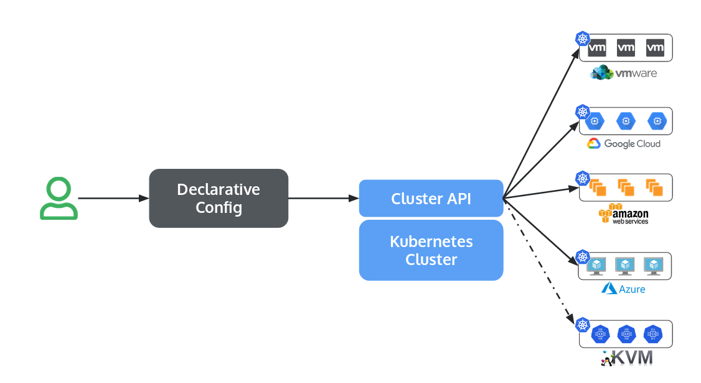
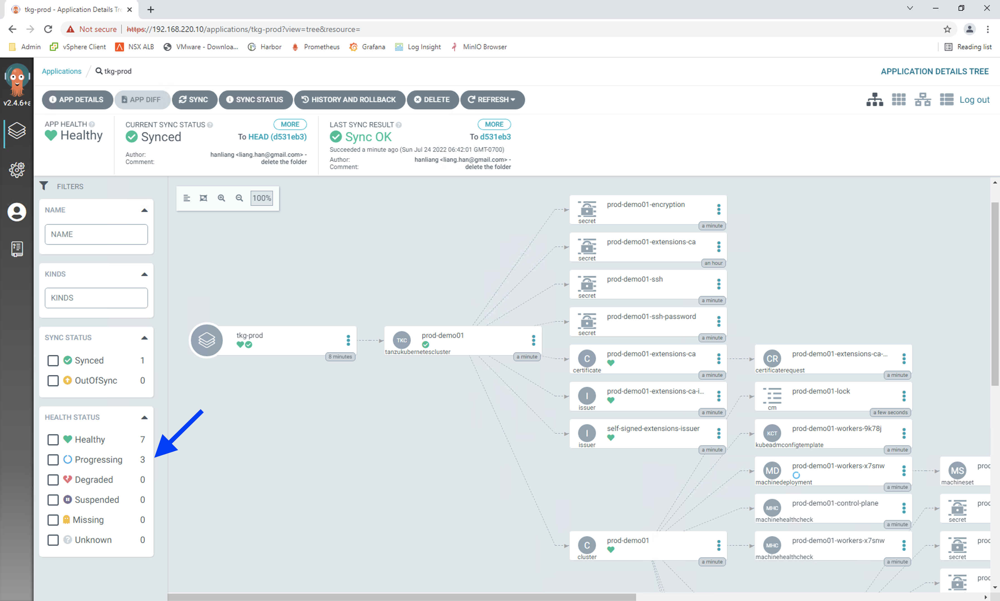
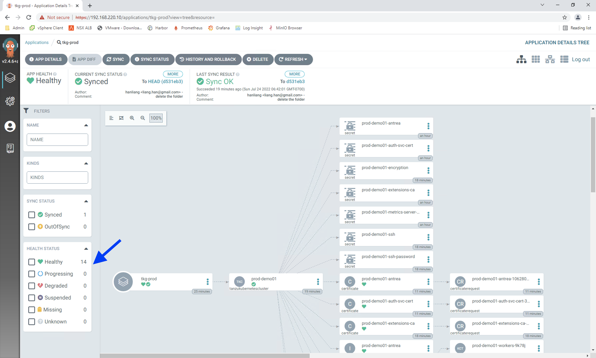

# 基于 K8s Cluster API 和 GitOps 的 Tanzu K8s 集群生命周期管理


## 1. 为何你需要 Cluster API 去管理 K8s 集群生命周期？

所谓 K8s 集群生命周期管理，简单的说，就是 create, scale, upgrade, destroy。 从传统 IT 资源生命周期管理的视角来看，管理 K8s 集群与管理其他 IT 资源并无特别的差异，无非就是换了一个命令或者一个 Web 用户界面。 Kubeadm 为绝大部分的 K8s 管理平台提供了通用的底层工具，主要用来创建（bootstrap） K8s 集群。 但在日常的运维中，管理员依然会面临如下的一些问题，比如： 1. 如何在异构的 K8s 集群管理平台上，提供一致性的方法去部署 worker nodes，VPC 网络，负载均衡等资源？ 2. 如何实现 K8s 自动化生命周期管理，比如 K8s 版本的升级，节点规格的变更，节点数量的变更等？

针对于以上的问题，Kubernetes 官方社区有个叫 sig-cluster-lifecycle 的特别兴趣小组（SIG），他们提出了一个统一的 K8s 集群管理方式，叫做 Cluster API。 Cluster API 最大的特点就是基于声明式的管理方式，使用 K8s 管理 K8s。 这个里面信息量稍微有点大，有三个要点：

1. 声明式： 声明式的特点就是用户只说明需要最终的状态，至于如何从当前状态到达最终状态，由平台实现。其实就是所谓的 Infrastructure as the code 的概念。 稍后我们会看一下 Tanzu Kubernetes Grid 是如何利用 YAML 格式描述 K8s 集群的。 

2. 用 K8s 管理 K8s：
  
稍微有点绕。 在 Cluster API 的设计里面，K8s集群分为两类：“管理集群” 和 “工作负载集群” （这个名词在不同的平台上面可能叫法有所区别）。 “工作负载集群”就是通常理解的运行业务应用的集群，在多集群管理的理念下，工作集群通常会有多个。 “管理集群” 也是 K8s 集群，不过它的用途就是管理各个 “工作负载集群” 的生命周期，包括创建、变更、销毁等。 管理集群通常只需要 1 个。 K8s 社区认为，既然 K8s 是个很好的平台管理 Pod、Deployment、Service 这些应用相关资源，那我们也扩展一下，用来管理 K8s 工作负载集群。 

3. 统一的方式：所谓，统一的方式，实际就是制定标准，希望各个平台都可以遵照。 这样用户做事情就比较简单，在异构的平台上采用同样的方式做事情。 事实上，业界的各位大佬也都在列。 https://cluster-api.sigs.k8s.io/reference/providers.html。 Cluster API 当前的版本是 1.2.  按照开源社区的逻辑，1.0 以上的版本就是稳定的，生产就绪的版本了。 不过，这个事情也不是每家都做的很完善，应该说，还在统一的路上。 毕竟，每家都有原本的实现方式，要改起来需要时间。

关于 Cluster API，更多的细节可以参看官方网站：https://cluster-api.sigs.k8s.io/

## 2. Tanzu Kubernets Grid 的 Cluster API 实现
Tanzu Kubernetes Grid 是 VMware 的 Cluster API 实现。 vSphere 7.0 采用的对应名词：“管理集群” -> "Supervisor Cluster“， ”工作负载集群“ -> "Guest Cluster“。 


Supervisor Cluster 通过下面的 YAML 文件描述 Guest Cluster。 这就是标准的 K8s YAML 文件。  这个 sample 拷贝自 vSphere 7.0 的官方文档。这个 sample 是最简单的，很多参数都省略，采用了默认值。 更多的 sample 和完整的参数，可以参看 https://docs.vmware.com/cn/VMware-vSphere/7.0/vmware-vsphere-with-tanzu/GUID-4838C85E-398D-4461-9C4E-561FADD42A07.html

``` YAML
apiVersion: run.tanzu.vmware.com/v1alpha1      #TKGS API endpoint
kind: TanzuKubernetesCluster                   #required parameter
metadata:
  name: tkgs-cluster-1                         #cluster name, user defined
  namespace: tgks-cluster-ns                   #vsphere namespace
spec:
  distribution:
    version: v1.20                             #Resolves to TKR 1.20
  topology:
    controlPlane:
      count: 1                                 #number of control plane nodes
      class: best-effort-medium                #vmclass for control plane nodes
      storageClass: vwt-storage-policy         #storageclass for control plane
    workers:
      count: 3                                 #number of worker nodes
      class: best-effort-medium                #vmclass for worker nodes
      storageClass: vwt-storage-policy         #storageclass for worker nodes
```

在官方文档中，管理员通过登录 Supervisor Cluster，并执行类似下面的命令进行 Guest Cluster 部署和变更。 

```
kubectl apply -f tkgs-cluster-1.yaml
```

篇幅限制，我们不详细介绍这个部分。 不熟悉的读者，可以参看官方文档或者其他公众号文章。 

## 3. Why not GitOps? 
GitOps 近年来大火。 越来越多的应用运维人员采用 code （YAML/Json 格式) 描述应用状态，使用 Git repository （GitHub/Gitlab 等）保存相应的YAML/Json文件。 并且通过 Git 流程（比如 Branch 的管理，Pull/Merge Request，Tag 等）完善了变更流程。 GitOps 有很多的优势，比如：

- 申明式管理和Single Source of Truth: 通过查看 git 存储库，管理员就可以准确了解集群中正在运行的内容
- 方便 Review 和 审计：对任何配置的变更都需要通过创建 Pull Request，并且经过预设的 review 流程，才能正式合并到相应的 branch。日后的审计也变得更加容易，因为每个更改都是 Git 中的一个 commit。
- 方便回滚: 一旦发现出现问题，状态的回滚可以通过剔除之前有问题的commit即可，通过声明式管理的方式，系统会自动恢复到之前的状态。 
- 配置可观测性：当运行环境配置被人为修改之后，可以通过比较当前配置和 Git repository中的配置，可以很快的发现配置漂移（configuration drifting），如果需要，可以自动纠正。 
- 变更更加方便：GitOps 通常采取 pull 的方式。 管理员只需要修改 Git Repository 中的配置文件，GitOps 平台会自动 pull 这些变更，对比与实际环境配置的差异，然后修改实际运行环境的配置。 

在前文中，我们已经提到，Cluster API 中的 Kubernetes 集群的生命周期管理方式，与原生的 Kubernetes 资源，比如 Deployment 的生命周期管理方式，并无本质差异。 当K8s平台管理员使用 GitOps + Cluster API 实现 K8s 集群的生命周期管理时，GitOps 的这些收益一样可以获得。 

开源社区有很多的工具，帮助实现 GitOps，比如 ArgoCD。 下图介绍如何通过 ArgoCD + GitHub + vSphere 7.0 实现 Tanzu Kuberentes 集群的生命周期管理。 


大致的流程如下：
1. 管理员通过 git 命令将 Tanzu guest cluster 1 的 YAML spec 变更 push 到 GitHub repo
2. ArgoCD 从 GitHub repo 中读取 spec，发现和现有的 spec 有差异
3. 管理员确认变更后，发起同步（sync）操作，将变更同步到 Tanzu Supervisor Cluster 中
4. Tanzu Supervisor Cluster 通过 Cluster API 对 Tanzu Guest Cluster 1 实施变更


## 4. Implementation：通过ArgoCD 和 GitHub 实现 vSphere 7.0 中的 Tanzu K8s集群的管理

Demo 环境的部署如下图所示。本图中的 1,2,3,4 对应与上图的流程。 


Demo 环境包含一个 vSphere 集群 和 github 的一个 repository，其中
- cli-vm 是一个工作机，安装 ubuntu 操作系统，部署各类客户端工具，包括 git、argocd cli、kubectl 等
- vSphere 集群中，enable VDS-based Tanzu Supervisor Cluster
- 部署 NSX Advanced Load Balancer（AVI)，为所有的 Tanzu K8s cluster 提供 LoadBalancer type 的 Service 负载均衡
- 创建 WCP namespace - IT, 此 namespace 归属 IT 部门管理，利用官方文档的标准步骤创建 guest cluster - it-tkg01. 在 it-tkg01 中部署 ArgoCD
- 创建 WCP namespace - prod，此 namespace 用来部署业务应用。 我们看到其中包含两个 guest cluster - prod-demo01，prod-demo02。这两个集群，是通过 GitOps 创建。 所有的变更也通过 GitOps 完成。 

以上环境，除去 prod-demo01、prod-demo02之外，我们 assume 其他组件都已经 ready。 接下来的部署包括：
1. 登录 Supervisor Cluster 创建一个基于 X509 证书的用户，并且通过 RBAC 授权 cluster-admin 的权限
2. 在 ArgoCD 中加入 Supervisor Cluster 作为 destination 之一
3. 在 gitlab repo 中 添加 Guest Cluster prod-demo01 的 YAML 描述文件
4. 在 ArgoCD 中添加 Application，读取 Github 中的 Guest Cluster YAML 文件，ArgoCD 自动 Sync，并且通过 Supervisor Cluster 创建 Guest Clusters

### 4.1 在Supervisor Cluster 中创建基于 X509 证书，并且通过 RBAC 授权 cluster-admin 的权限

首先要说明一下，Supervisor Cluster 不是一个 CNCF-Conformance 的 K8s 集群，而且通过通常的步骤无法获得集群管理员权限，我们需要通过一些特别的方法，登录到 Supervisor Cluster Control Plane VM 获取最高权限。具体可以参看 https://williamlam.com/2020/10/how-to-ssh-to-tanzu-kubernetes-grid-tkg-cluster-in-vsphere-with-tanzu.html。 参考文中的 Option2 的 Step1 和 Step2。 在登录到 Supervisor Cluster Control Plane VM 的 shell console 之后，我们执行下面的步骤。 **注意，下面的所有的操作都是 Supervisor Cluster Control Plane VM 的 shell console 中。 **

#### 4.1.1 通过 openssl 命令创建 argocd-admin 用户的私钥和 CSR
``` bash
openssl req -new -newkey rsa:4096 -nodes -keyout argocd-admin.key -out argocd-admin.csr -subj "/CN=argocd-admin"
```
#### 4.1.2 通过 K8s CA 签名 argocd-admin 用户，并基于此构建 kubeconfig 文件

1. 创建 K8s Certificate Signing Request
``` yaml
cat <<EOF | kubectl apply -f -
apiVersion: certificates.k8s.io/v1
kind: CertificateSigningRequest
metadata:
  name: argocd-admin-csr
spec:
  request: $(cat argocd-admin.csr | base64 | tr -d '\n')
  signerName: kubernetes.io/kube-apiserver-client
  usages:
  - client auth
EOF
```
通过 `kubectl get csr`, 我们可以看到当前CSR处于 Pending 状态，如下所示：

``` bash
root@4218f4c1cb3ea4b84e2f33cd6046b682 [ ~ ]# kubectl get csr
NAME               AGE   SIGNERNAME                            REQUESTOR          CONDITION
argocd-admin-csr   5s    kubernetes.io/kube-apiserver-client   kubernetes-admin   Pending
```

2. 手动 Approve 这个证书签名请求
```
kubectl certificate approve argocd-admin-csr
```
再次查看证书状态

``` bash
root@4218f4c1cb3ea4b84e2f33cd6046b682 [ ~ ]# kubectl get csr
NAME               AGE     SIGNERNAME                            REQUESTOR          CONDITION
argocd-admin-csr   2m10s   kubernetes.io/kube-apiserver-client   kubernetes-admin   Approved,Issued
```

3. 创建 kubeconfig 文件

获取签名后的 argocd-admin 证书
```
kubectl get csr argocd-admin-csr -o jsonpath='{.status.certificate}' | base64 --decode > argocd-admin-csr.crt
```

获取 K8s CA 的证书
``` bash
kubectl config view -o jsonpath='{.clusters[0].cluster.certificate-authority-data}' --raw | base64 --decode - > kubernetes-ca.crt
```

构建 kubeconfig 文件 argocd-admin-config 
``` bash
kubectl config set-cluster $(kubectl config view -o jsonpath='{.clusters[0].name}') --server=$(kubectl config view -o jsonpath='{.clusters[0].cluster.server}') --certificate-authority=kubernetes-ca.crt --kubeconfig=argocd-admin-config --embed-certs

kubectl config set-credentials argocd-admin --client-certificate=argocd-admin-csr.crt --client-key=argocd-admin.key --embed-certs --kubeconfig=argocd-admin-config

kubectl config set-context Tanzu-SVC --cluster=$(kubectl config view -o jsonpath='{.clusters[0].name}') --namespace=default --user=argocd-admin --kubeconfig=argocd-admin-config

kubectl config use-context Tanzu-SVC --kubeconfig=argocd-admin-config
```

4. 验证
``` bash
kubectl get pod  --kubeconfig=argocd-admin-config
```
我们会得到如下提示，这是正常的，因为我们还没有在 K8s 中给 argocd-admin 用户授权。
``` bash
root@4218f4c1cb3ea4b84e2f33cd6046b682 [ ~ ]# kubectl get pod  --kubeconfig=argocd-admin-config
Error from server (Forbidden): pods is forbidden: User "argocd-admin" cannot list resource "pods" in API group "" in the namespace "default"
```

#### 4.1.3 在 Supervisor Cluster 中进行授权
说明一下，此步骤，为了验证方便，我们授予了 cluster-admin 权限。 在实际生产环境中，根据最小权限原则，我们需要创建细粒度的 ClusterRole。 

```yaml
cat <<EOF | kubectl apply -f -
apiVersion: rbac.authorization.k8s.io/v1
kind: ClusterRoleBinding
metadata:
  name: argocd-admin-clusterrolebinding
subjects:
- apiGroup: rbac.authorization.k8s.io
  kind: User
  name: argocd-admin
roleRef:
  kind: ClusterRole
  name: cluster-admin
  apiGroup: ""
EOF
```

### 4.2 在 ArgoCD 中加入 Supervisor Cluster 作为 destination 之一

本节的操作在 cli-vm 中进行。 我们需要从上节操作的 Supervisor Cluster Control Plane VM 中拷贝 argocd-admin-config 文件，到 cli-vm。 ** 请务必设定最小的文件读写权限 **。  我们通过一下命令可以添加 Tanzu Supervisor Cluster 作为 ArgoCD 的 Destination。 

``` bash
ubuntu@cli-vm:~$ argocd cluster add Tanzu-SVC --kubeconfig=argocd-admin-config
WARNING: This will create a service account `argocd-manager` on the cluster referenced by context `Tanzu-SVC` with full cluster level privileges. Do you want to continue [y/N]? y
INFO[0003] ServiceAccount "argocd-manager" already exists in namespace "kube-system"
INFO[0003] ClusterRole "argocd-manager-role" updated
INFO[0003] ClusterRoleBinding "argocd-manager-role-binding" updated
Cluster 'https://192.168.110.101:6443' added
```

### 4.3 在 gitlab repo 中 添加 Guest Cluster prod-demo01 的 YAML 描述文件

我们在 https://github.com/alexhanl/argocd-tanzu/prod 目录中创建 prod-demo01.yaml 文件, 如下所示。 这是一个生产可用的描述文件。

``` YAML
apiVersion: run.tanzu.vmware.com/v1alpha1
kind: TanzuKubernetesCluster
metadata:
  name: prod-demo01
  namespace: prod
spec:
  topology:
    controlPlane:
      count: 1
      class: best-effort-large
      storageClass: k8s-policy
      volumes:
        - name: etcd
          mountPath: /var/lib/etcd
          capacity:
            storage: 50Gi
        - name: containerd
          mountPath: /var/lib/containerd
          capacity:
            storage: 50Gi
    workers:
      count: 1
      class: best-effort-large
      storageClass: k8s-policy
      volumes:
        - name: containerd
          mountPath: /var/lib/containerd
          capacity:
            storage: 100Gi
  distribution:
    version: 1.21.6
  settings:
    storage: 
      classes: [ "k8s-policy" ]
      defaultClass: k8s-policy
    network:
      cni:
        name: antrea
      services:
        cidrBlocks: ["172.22.0.0/16"]
      pods:
        cidrBlocks: ["172.23.0.0/16"]
```

### 4.4 在 ArgoCD 中添加 Application，读取 Github 中的 Guest Cluster YAML 文件，ArgoCD 自动 Sync，并且通过 Supervisor Cluster 创建 Guest Clusters

#### 4.4.1 通过下面的命令行，我们增加一个 argocd app - tkg-prod
``` bash
ubuntu@cli-vm:~$ argocd app create tkg-prod --repo https://github.com/alexhanl/argocd-tanzu.git --path prod --dest-server https://192.168.110.101:6443 --dest-namespace prod
application 'tkg-prod' created
```

通过 argocd 的 Web UI，我们可以看到如下的应用状态。 
 

#### 4.4.2 通过 ArgoCD 同步状态，实现 prod-demo01 guest cluster 的自动部署
点击 "Sync", ArgoCD 会自动同步 git repo 的 YAML 配置 到 Tanzu Supervisor Cluster。 本质上就是在 Supervisor Cluster 上面执行 `kubectl apply -f prod-demo01.yaml` 命令。 在 ArgoCD Web UI 上面，我们点击 tkg-prod 应用，可以看到应用同步的状态。 

 

在上图中，我们可以看到很多的 Cluster-API 的 Resource， 其中有的正处于 "Progressing" 状态。 通过 Tanzu Supervisor Cluster，我们也可以看到 集群的状态。 

``` bash
ubuntu@cli-vm:~$ kubectl get tkc
NAME          CONTROL PLANE   WORKER   TKR NAME                           AGE     READY   TKR COMPATIBLE   UPDATES AVAILABLE
prod-demo01   1               1        v1.21.6---vmware.1-tkg.1.b3d708a   9m12s   False   True
```

我们等待一段时间，当所有的Resource都是Healthy 状态的时候，我们就可以使用 prod-demo01 这个 guest cluster 了。 

 
```
ubuntu@cli-vm:~$ kubectl get tkc
NAME          CONTROL PLANE   WORKER   TKR NAME                           AGE   READY   TKR COMPATIBLE   UPDATES AVAILABLE
prod-demo01   1               1        v1.21.6---vmware.1-tkg.1.b3d708a   19m   True    True
```

接下来，我们可以修改 prod-demo01.yaml 文件，比如增加一个 worker node，或者增加新的 guest cluster prod-demo02.yaml，然后重复4.2.2 的步骤，就可以看到集群状态的变更。 


## 5. 总结

本文主要利用 GitOps 的方法，基于 K8s Cluster API，对 K8s 集群进行生命周期管理。 本方式，对于运维人员来说，K8s 集群生命周期管理更加规范，也更加方便。 本文的后半段篇幅主要讲述了基于 Tanzu Kubernetes Grid 的实现方式。 

## 6. 参考资料
- https://www.infracloud.io/blogs/multicluster-gitops-argocd/
- https://argo-cd.readthedocs.io/en/stable/getting_started/
- https://medium.com/swlh/how-we-effectively-managed-access-to-our-kubernetes-cluster-38821cf24d57


